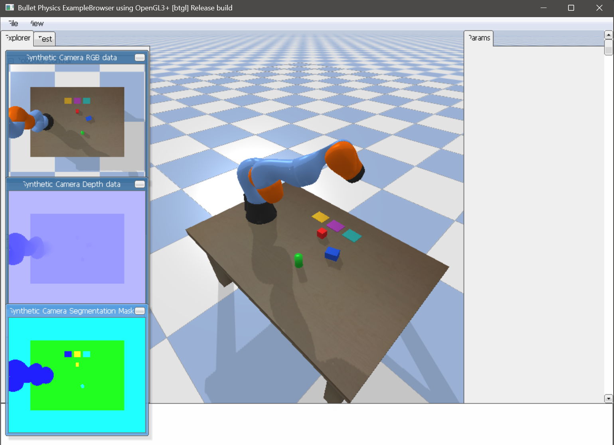
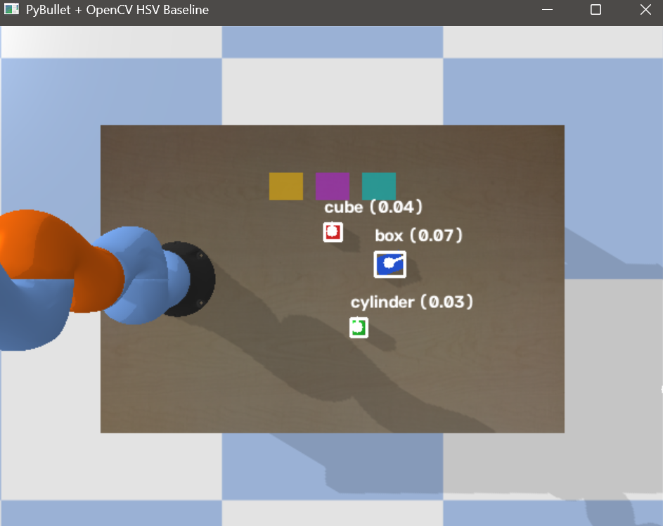
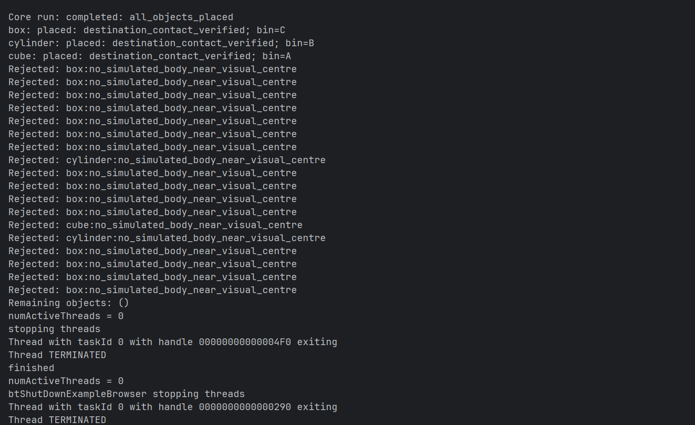
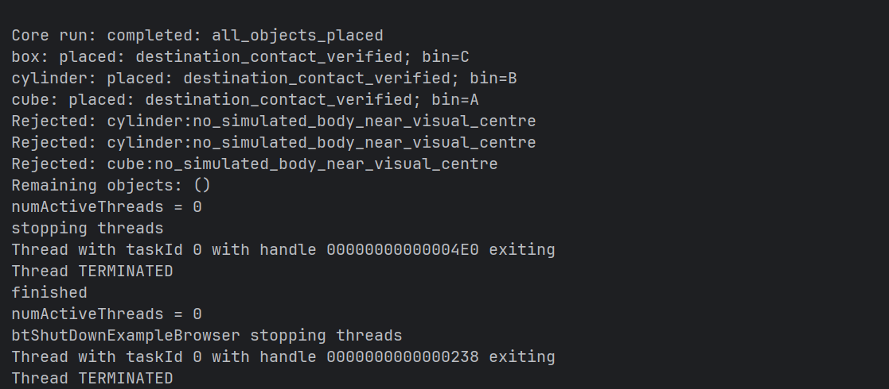
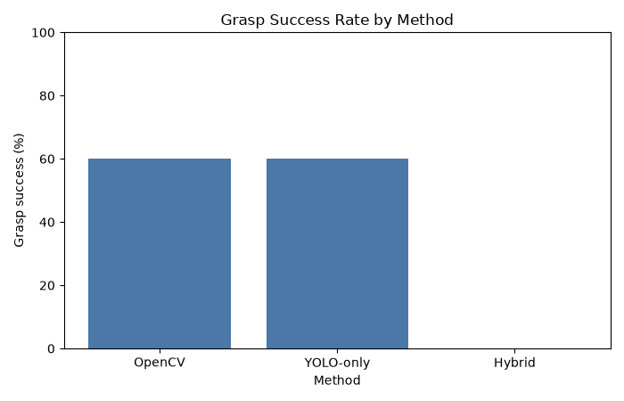
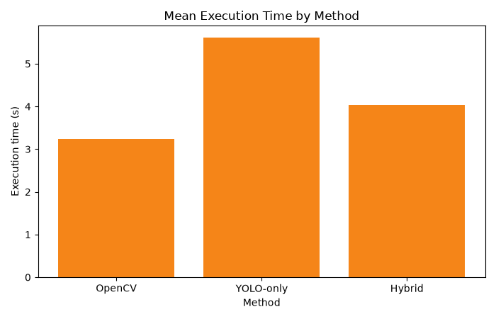

<div align="center">

# Vision-Based Robotic Arm for Intelligent Tabletop Pick-and-Place

Simulation-first visual perception and autonomous pick-and-place with a KUKA iiwa in PyBullet.

[](https://www.python.org/)
[](https://pybullet.org/)
[](https://opencv.org/)
[](https://github.com/ultralytics/ultralytics)
[](https://pytorch.org/)

</div>

## Demo



<table>
<tr>
<td align="center"><br><sub>Overhead RGB camera</sub></td>
<td align="center"><br><sub>OpenCV baseline run</sub></td>
<td align="center"><br><sub>YOLO-only run</sub></td>
</tr>
</table>

## Demo Video

The local demo video is [docs/media/robot_demo.mp4](docs/media/robot_demo.mp4) (approximately 112 MB). Because this exceeds the normal GitHub file limit, upload it as a GitHub Release asset or another hosted demo before publishing a permanent link.

The video should show scene initialization, detection, grasp, lift, destination transfer, release, and placement verification.

## Overview

The project simulates an intelligent tabletop pick-and-place system. A fixed overhead RGB camera observes objects, the selected perception mode estimates their image pose, and the shared planning stack maps pixels to world coordinates, checks reachability and clearance, ranks grasps, solves inverse kinematics, and sorts objects into class-specific bins.

## Key Features

- PyBullet tabletop simulation with a KUKA iiwa
- Fixed overhead RGB camera
- OpenCV HSV baseline with contour and minimum-area-rectangle pose estimation
- Custom YOLOv8n detector
- Confidence-gated YOLO/OpenCV hybrid validation
- Planar homography and pixel-to-world mapping
- Reachability and gripper-clearance checks
- Graspability ranking and bounded robot control
- Simulation-only grasp attachment and placement verification
- Randomized trial logging, comparison, failure analysis, and plots

## System Architecture

```text
PyBullet Scene
  ↓
Fixed RGB Camera
  ↓
OpenCV / Custom YOLOv8n
  ↓
Confidence-Gated Hybrid Validation
  ↓
Pose Estimation
  ↓
Pixel-to-World Homography
  ↓
Reachability + Gripper Clearance
  ↓
Graspability Ranking
  ↓
Inverse Kinematics
  ↓
KUKA Controller
  ↓
Simulation Gripper
  ↓
Destination Placement
  ↓
Placement Verification
```

## Supported Objects

| Class ID | Object | Destination |
| --- | --- | --- |
| 0 | Cube | Bin A |
| 1 | Cylinder | Bin B |
| 2 | Box | Bin C |

## Perception Modes

### OpenCV baseline

HSV colour segmentation, morphology, contour extraction, centroid estimation, and minimum-area rectangles. The `baseline_score` is a heuristic image score, not learned confidence.

### YOLO-only

A custom YOLOv8n model trained on the synthetic PyBullet dataset supplies class, confidence, bounding box, and image centre.

### Hybrid

The detector confidence gate remains:

- `confidence >= 0.80`: accept directly
- `0.50 <= confidence < 0.80`: run OpenCV validation
- `confidence < 0.50`: reject and reobserve

The current runtime scene produced confidences of 0.2518 (cylinder), 0.0828 (cube), and 0.0368 (box). Hybrid therefore rejected the scene safely; thresholds were not weakened.

## Dataset

The final training dataset contains **90 synthetic 640×480 PyBullet images**. Physics settling is completed before capture, and YOLO boxes are calculated from visible segmentation-mask pixels for target body IDs only.

| Split | Images |
| --- | ---: |
| Train | 62 |
| Validation | 13 |
| Test | 15 |

The target split was 70/15/15; the actual reproducible split is 62/13/15. Class instances are:

| Class | Instances |
| --- | ---: |
| Cube | 62 |
| Cylinder | 61 |
| Box | 70 |

Generate and validate the dataset with:

```bash
python -m data.scripts.build_yolo_dataset --count 90 --seed 42 --min-objects 1 --max-objects 3
python data/scripts/validate_yolo_dataset.py data/yolo_dataset
```

## YOLO Model and Results

The final model is YOLOv8n, initialized from `yolov8n.pt`, trained for 15 epochs on CPU. Metrics below were **measured on the held-out synthetic test split**.

| Metric | Value |
| --- | ---: |
| Precision | 0.9886 |
| Recall | 0.8586 |
| mAP@0.5 | 0.9950 |
| mAP@0.5:0.95 | 0.8331 |

The working weights are expected at `models/yolo/best.pt`. They are ignored by Git; obtain them from the project owner/release or reproduce them with:

```bash
python data/scripts/train_yolo.py --data data/yolo_dataset/dataset.yaml --epochs 15 --batch 8 --device cpu
python data/scripts/train_yolo.py --data data/yolo_dataset/dataset.yaml --pretrained models/yolo/best.pt --test --device cpu
```

## Controlled Runtime Results

| Method | Controlled Demo | Result |
| --- | --- | --- |
| OpenCV baseline | Success | All three objects placed correctly |
| YOLO-only | Success | All three objects placed correctly using `models/yolo/best.pt` |
| Hybrid | Safe rejection | Runtime confidence remained below the 0.50 gate |

## Randomized Smoke Results

**Diagnostic randomized smoke trials (n=5 per method), not a statistically significant benchmark.**

| Method | Grasp Success | Placement Success | Mean Execution Time |
| --- | ---: | ---: | ---: |
| OpenCV baseline | 3/5 | 0/5 | 3.24 s |
| YOLO-only | 3/5 | 0/5 | 5.61 s |
| Hybrid | 0/5 | 0/5 | 4.03 s |





## Installation

```bash
python -m venv .venv
# Windows
.venv\Scripts\activate
# Linux/macOS
source .venv/bin/activate

pip install -r requirements.txt
```

The project was runtime-tested on Windows with a compatible PyBullet package and the dependencies declared in `requirements.txt`.

## Running the Project

### Camera and OpenCV perception demo

```bash
python -m simulation.demo_vision
```

### OpenCV baseline

```bash
python -m simulation.run_pick_and_place --mode baseline --max-observations 12 --max-picks 6
```

### YOLO-only

```bash
python -m simulation.run_pick_and_place --mode yolo --weights models/yolo/best.pt --max-observations 12 --max-picks 6
```

### Hybrid

```bash
python -m simulation.run_pick_and_place --mode hybrid --weights models/yolo/best.pt --max-observations 12 --max-picks 6
```

### Dataset, training, and validation

```bash
python -m data.scripts.build_yolo_dataset --count 90 --seed 42 --min-objects 1 --max-objects 3
python data/scripts/validate_yolo_dataset.py data/yolo_dataset
python data/scripts/train_yolo.py --data data/yolo_dataset/dataset.yaml --epochs 15 --batch 8 --device cpu
```

### Experiments and plots

```bash
python -m experiments.run_trials --trials 5 --method opencv --output-dir experiments/results
python -m experiments.run_trials --trials 5 --method yolo --weights models/yolo/best.pt --output-dir experiments/results
python -m experiments.run_trials --trials 5 --method hybrid --weights models/yolo/best.pt --output-dir experiments/results
python -m experiments.compare_methods
python -m experiments.plot_results
```

The raw detector diagnostic is:

```bash
python data/scripts/diagnose_runtime_confidence.py --weights models/yolo/best.pt
```

## Repository Structure

```text
core/          Shared contracts and configuration
perception/    OpenCV, YOLO, hybrid validation, calibration, pose
robot/         IK, controller, gripper, graspability, pick-and-place
simulation/    PyBullet scene, camera, and integrated runner
data/scripts/  Dataset generation, validation, training, diagnostics
experiments/   Trial runner, logging, aggregation, failure analysis, plots
tests/         Core and evaluation tests
docs/          Architecture, limitations, and media
```

## Limitations

- Simulation-only system; no real robot or camera validation.
- Dataset is synthetic and does not capture real optics, textures, or lighting.
- Grasping uses a simulation constraint rather than a physical gripper.
- Hybrid runtime confidence is below the configured 0.50 threshold.
- Randomized-scene robustness remains limited.
- Detector confidence calibration and generalization can be improved.

## Future Work

- Larger and more diverse synthetic datasets
- Confidence calibration and improved detector generalization
- Stronger hybrid runtime robustness
- Real camera and physical gripper integration
- RGB-D and 6-DoF pose estimation
- ROS 2 and MoveIt 2 integration

See [DATASET.md](DATASET.md), [Architecture.md](Architecture.md), and [docs/LIMITATIONS.md](docs/LIMITATIONS.md) for implementation details and limitations.
